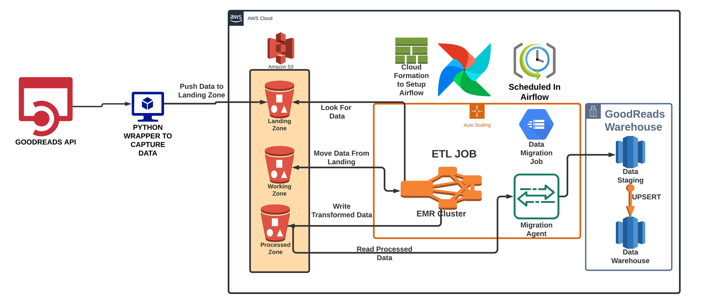
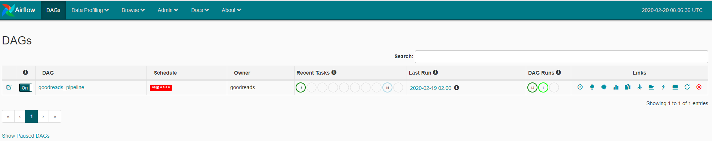
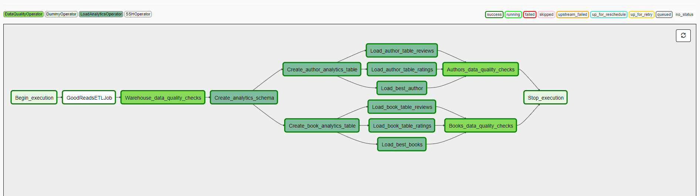
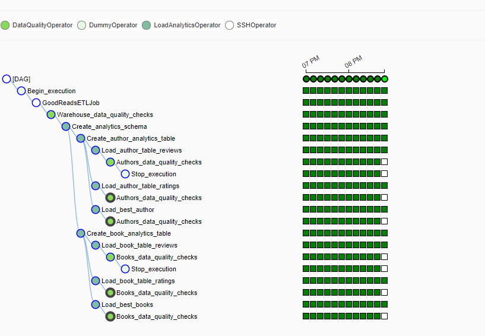
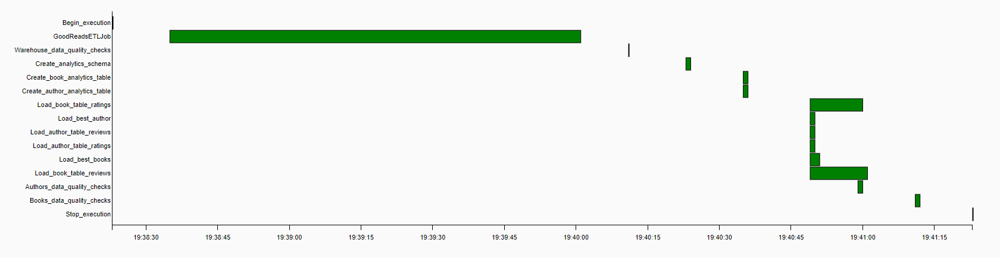
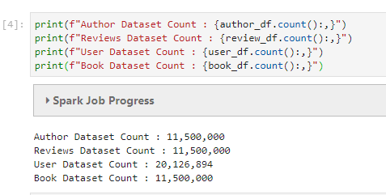
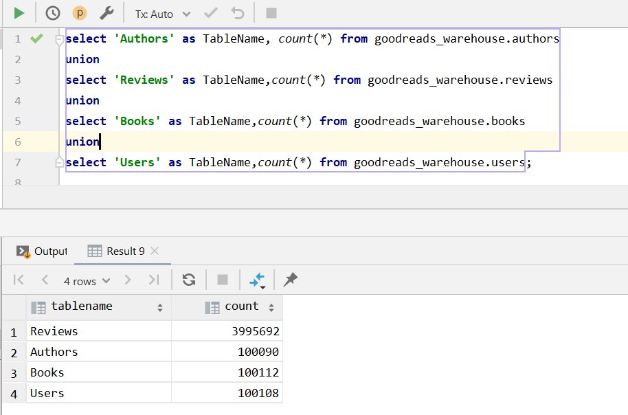

# GoodReads Data Pipeline

   

Near-real-time data pipeline that lands GoodReads data in S3, transforms it with Spark on EMR every 10 minutes, and UPSERTs it into a Redshift warehouse, orchestrated by Airflow with built-in data-quality checks. Load-tested at ~68 GB/hour.

## Architecture 

Pipeline Consists of various modules:

 - GoodReads Python Wrapper (third-party library: [san089/goodreads](https://github.com/san089/goodreads))
 - ETL Jobs
 - Redshift Warehouse Module
 - Analytics Module 

#### Overview
Data is captured in real time from the goodreads API using the Goodreads Python wrapper (View usage - [Fetch Data Module](https://github.com/san089/goodreads/blob/master/example/fetchdata.py)). The data collected from the goodreads API is stored on local disk and is timely moved to the Landing Bucket on AWS S3. ETL jobs are written in spark and scheduled in airflow to run every 10 minutes.  

### ETL Flow

 - Data Collected from the API is moved to landing zone s3 buckets.
 - ETL job has s3 module which copies data from landing zone to working zone.
 - Once the data is moved to working zone, spark job is triggered which reads the data from working zone and apply transformation. Dataset is repartitioned and moved to the Processed Zone.
 - Warehouse module of ETL jobs picks up data from processed zone and stages it into the Redshift staging tables.
 - Using the Redshift staging tables and UPSERT operation is performed on the Data Warehouse tables to update the dataset.
 - ETL job execution is completed once the Data Warehouse is updated. 
 - Airflow DAG runs the data quality check on all Warehouse tables once the ETL job execution is completed.
 - Airflow DAG has Analytics queries configured in a Custom Designed Operator. These queries are run and again a Data Quality Check is done on some selected Analytics Table.
 - Dag execution completes after these Data Quality check.

## Environment Setup

### Hardware Used
EMR - I used a 3 node cluster with below Instance Types:

    m5.xlarge
    4 vCore, 16 GiB memory, EBS only storage
    EBS Storage:64 GiB
Redshift: For Redshift I used 2 Node cluster with Instance Types `dc2.large`

### Setting Up Airflow

I have written detailed instructions on how to setup Airflow using AWS CloudFormation script. Check out the external guide - [Airflow using AWS CloudFormation](https://github.com/san089/Data_Engineering_Projects/blob/master/Airflow_Livy_Setup_CloudFormation.md)

**NOTE: This setup uses EC2 instance and a Postgres RDS instance. Make sure to check out charges before running the CloudFormation Stack.** 

Project uses `sshtunnel` to submit spark jobs using a ssh connection from the EC2 instance. This setup does not automatically install `sshtunnel` for apache airflow. You can install by running below command: 

    pip install apache-airflow[sshtunnel]

Finally, copy the dag and plugin folder to EC2 inside airflow home directory. Also, checkout [Airflow Connection](docs/Airflow_Connections.md) for setting up connection to EMR and Redshift from Airflow.

### Setting up EMR
Spinning up EMR cluster is pretty straight forward. You can use AWS Guide available [here](https://docs.aws.amazon.com/emr/latest/ManagementGuide/emr-gs.html).

ETL jobs in the project uses [psycopg2](https://pypi.org/project/psycopg2/) to connect to Redshift cluster to run staging and warehouse queries. 
To install psycopg2 on EMR:

    sudo pip-3.6 install psycopg2

psycopg2 uses `postgresql-devel` and `postgresql-libs`, and sometimes pscopg2 installation may fail if these dependencies are not available. To install run commands:

    sudo yum install postgresql-libs
    sudo yum install postgresql-devel

ETL jobs also use [boto3](https://boto3.amazonaws.com/v1/documentation/api/latest/index.html) move files between s3 buckets. To install boto3 run:

    pip-3.6 install boto3 --user

Finally, pyspark uses python2 as default setup on EMR. To change to python3, setup environment variables:

    export PYSPARK_DRIVER_PYTHON=python3
    export PYSPARK_PYTHON=python3

Copy the ETL scripts to EMR and we have our EMR ready to run jobs. 

### Setting up Redshift
You can follow the AWS Guide to run a Redshift cluster or alternatively you can use the external [Redshift_Cluster_IaC.py](https://github.com/san089/Data_Engineering_Projects/blob/master/Redshift_Cluster_IaC.py) Script to create cluster automatically. 

## How to run 
Make sure Airflow webserver and scheduler is running. 
Open the Airflow UI `http://< ec2-instance-ip >:< configured-port >` 

GoodReads Pipeline DAG

DAG View:

DAG Tree View:

DAG Gantt View: 

## Testing the Limits
The `goodreadsfaker` module in this project generates Fake data which is used to test the ETL pipeline on heavy load.  

To test the pipeline I used `goodreadsfaker` to generate 11.4 GB of data which is to be processed every 10 minutes (including ETL jobs + populating data into warehouse + running analytical queries) by the pipeline which equates to around 68 GB/hour and about 1.6 TB/day.

Source DataSet Count:

DAG Run Results:

Data Loaded to Warehouse:

## Scenarios

- Data increase by 100x. read > write. write > read
    
    - Redshift: Analytical database, optimized for aggregation, also good performance for read-heavy workloads
    - Increase EMR cluster size to handle bigger volume of data

- Pipelines would be run on 7am daily. how to update dashboard? would it still work?
    
    - DAG is scheduled to run every 10 minutes and can be configured to run every morning at 7 AM if required. 
    - Data quality operators are used at appropriate position. In case of DAG failures email triggers can be configured to let the team know about pipeline failures.
    
- Make it available to 100+ people
    - We can set the concurrency limit for your Amazon Redshift cluster. While the concurrency limit is 50 parallel queries for a single period of time, this is on a per cluster basis, meaning you can launch as many clusters as fit for your business.

## Maintainer
Madhav Meesala
Software Engineer
Email: madhavmeesala@gmail.com

Madhav is a Software Engineer with over 4 years of experience building scalable full-stack and distributed systems. He specializes in Python, Java, and AWS cloud-native development, with a focus on delivering high-performance data engineering solutions and microservices.